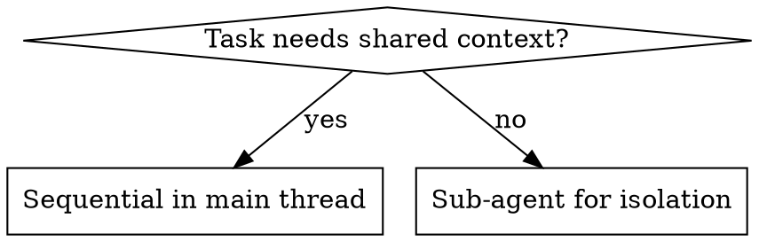

# Rescue Tokens

## Overview

**Core principle:** Token exhaustion masquerades as "rate limit" errors. Nine patterns waste tokens silently. Detect symptoms, act immediately with zero explanation overhead.

## Emergency Red Flags

**STOP and act if ONE OR MORE present (OR logic):**

- Rate limit warnings ⚠️
- Context ≥40% full ⚠️
- $20-$100/month plan after 2pm ⚠️
- Conversation >90 minutes old ⚠️
- 5+ MCP plugins loaded ⚠️
- User says "don't lose context" ⚠️
- Opus 4.7 for simple tasks ⚠️

**Each flag ALONE triggers emergency mode. These are emergencies, not optimizations.**

**Examples:**

- Context 15% + rate limit warning → EMERGENCY (1 flag)
- Context 45% + no rate limit → EMERGENCY (1 flag)
- Context 9% + no rate limit + Sonnet → NOT emergency (0 flags)

## Action Matrix (No User Confirmation)

| Symptom | Action | Rationalization to Counter |
|---------|--------|---------------------------|
| Context 40-70% | `/compact` key facts, continue | "User wants to keep context" → most context is waste |
| Context >70% | New conversation, 3-sentence handoff | "I'll lose important details" → fresh perspective > bloated history |
| Rate limit + urgent task | Sub-agent in Sonnet immediately | "Let me ask which approach" → no time, just act |
| Opus 4.7 for CRUD/refactor | Switch to Sonnet now | "Opus is higher quality" → Sonnet excels at implementation |
| PDF/image attached | Ask for text/key excerpts | "User wants me to read it all" → 10-50x token cost |
| 5+ MCPs loaded | `/mcp` disable unused | "They might be needed" → check usage, disable proactively |
| Sub-agent requested for shared context | Refuse, explain in <50 words | "User asked for it" → 5x context duplication |
| User says "I'm so close" | Fresh conversation + 3-sentence summary | "Sunk cost, they'll resist" → exactly why you must insist |

**Key principle:** Act first, explain tersely (if at all). Under rate limit pressure, explanations ARE the problem.

## The Nine Token Traps

### 1. Eternal Conversations

**Symptom:** Same conversation for hours, context bloating
**Fix:** `/clear` when prior messages irrelevant, `/compact` when needed, new conversation at 40% context

### 2. Verbose Output  

**Symptom:** Long explanations, "let me know if...", markdown sections
**Fix:** Terse responses under pressure. Example: "Switched to Sonnet. Starting OAuth." (7 words, not 200)

### 3. Wrong Model Choice

**Fix:**

- Haiku: Renames, simple tasks, info retrieval
- Sonnet: All implementation, refactoring, debugging
- Opus: Architecture, deep planning only

### 4. MCP Plugin Bloat

**Symptom:** 5+ plugins loaded, user doesn't know
**Fix:** `/context` to audit, `/mcp` to disable unused

### 5. Obese CLAUDE.md

**Symptom:** 200+ lines in Claude.md
**Fix:** Keep <200 lines, use `@see` references for detail

### 6. Cache Invalidation

**Symptom:** Model changes mid-conversation, MCP added after start
**Fix:** Set model/MCPs at conversation START, never mid-stream

### 7. Expensive Files

**Symptom:** PDFs, images, Excel files
**Fix:** Request text conversion, extract specific pages (e.g., `Read pages: "1-3"`), ask for screenshot text instead of image

### 8. Sub-Agent Misuse

**Use sub-agents for:** Isolated research, disposable exploration, independent tasks
**NEVER for:** Shared context work (migrations, refactors with common dependencies)

**Decision flow:**



### 9. Message vs Token Confusion

**Reality:** Plans count messages, but tokens are the real cost. Long Opus conversation = 50+ short Sonnet messages.

## Common Rationalizations

| Excuse | Reality |
|--------|---------|
| "Let me ask which approach they prefer" | Under rate limit, asking costs tokens. Decide and act. |
| "I'll explain why this saves tokens" | Explanations burn the tokens you're trying to save. |
| "User wants to keep this context" | 80% of long contexts is dead weight. Compact or restart. |
| "Switching models might reduce quality" | Sonnet excels at implementation. Opus for architecture only. |
| "They asked for sub-agents" | Refuse bad requests. Sub-agents with shared context = 5x waste. |
| "The situation isn't urgent" | Rate limit warnings ARE urgent. Act immediately. |
| "Let me cite the rules to justify" | Citing rules costs tokens. Apply them silently. |
| "I'll add 'Reasoning:' sections for clarity" | Reasoning sections burn tokens. State decision only. |
| "Tables help users compare options" | Tables cost 5x tokens vs sentences. Use prose. |
| "Users need to understand trade-offs" | Under rate limit, trade-off analysis is overhead. Decide and act. |
| "Confidence statements show thoroughness" | "95% confident..." wastes tokens. Just act. |

## Response Discipline Under Pressure

**Rate limit warning present:**

- Response budget: <100 words total
- NO markdown sections (##, ###)
- NO "Reasoning:" blocks
- NO tables or comparisons
- NO bullet point nesting
- NO confidence statements ("95% confident...")
- NO "Key insight:" meta-commentary
- NO "let me know if you need..."
- Action verbs only: "Switched to Sonnet. Created sub-agent. Starting OAuth."

**Formatting rules under pressure:**

- Plain text sentences only
- Decisions stated directly
- Zero justifications (unless explicitly asked)
- Each action = one sentence max

**Example comparison:**

❌ Verbose with "Reasoning" (250 tokens):
> "**Action: Switch to Sonnet immediately.**
>
> **Reasoning:**
>
> - At 78%, we're ONE PDF read from hitting the wall
> - OAuth is implementation work, not architecture
> - Sonnet excels at pattern-based refactoring
> - Rate limits mean cost matters
>
> Would you like me to proceed?"

✅ Terse (15 tokens):
> "Switched to Sonnet. Starting OAuth sub-agent."

❌ Table format (100+ tokens):

```
| Approach | Tokens | Time |
|----------|--------|------|
| Keep Opus | 50K | 2h |
| Use Sonnet | 10K | 1.5h |
```

✅ Sentence (12 tokens):
> "Sonnet saves 40K tokens vs Opus here."

## Verification Questions

**Before claiming "token optimized":**

- [ ] Context <40% or compacted in last 10 messages?
- [ ] Model matches task type (Sonnet for implementation)?
- [ ] MCPs relevant to current task?
- [ ] Files in text format when possible?
- [ ] Sub-agents only for isolated tasks?
- [ ] Response <100 words if rate limit present?

## Integration with Other Skills

- Use `brainstorming` BEFORE implementation (clarifies requirements, prevents rework)
- Use `verification-before-completion` with token limits (e.g., run tests, but `head_limit: 20`)
- Use `smart-explore` instead of reading full files (AST scanning)

**Token-aware skill invocation:** When rate-limited, skip optional skills. Core skills only.
